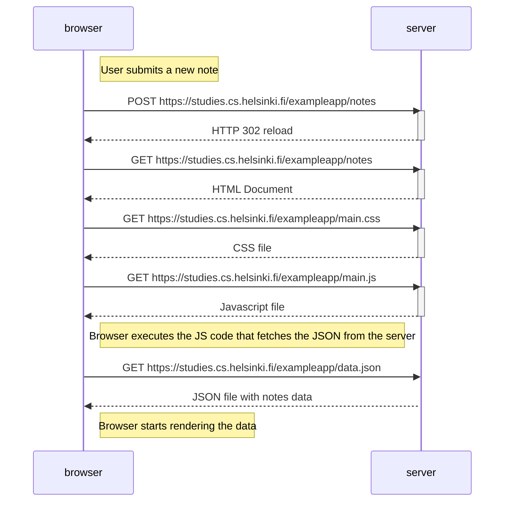

```mermaid

sequenceDiagram
    participant browser 
    participant server

    Note right of browser: User submits a new note
    browser->>server: POST https://studies.cs.helsinki.fi/exampleapp/notes
    activate server
    server-->>browser: HTTP 302 reload
    deactivate server

    browser->>server: GET https://studies.cs.helsinki.fi/exampleapp/notes
    activate server
    server-->>browser: HTML Document
    deactivate server

    browser->>server: GET https://studies.cs.helsinki.fi/exampleapp/main.css
    activate server 
    server-->>browser: CSS file 
    deactivate server

    browser->>server: GET https://studies.cs.helsinki.fi/exampleapp/main.js
    activate server
    server-->>browser: Javascript file 
    deactivate server 

    Note right of browser: Browser executes the JS code that fetches the JSON from the server 
    browser->>server: GET https://studies.cs.helsinki.fi/exampleapp/data.json
    activate server
    server-->>browser: JSON file with notes data 
    Note right of browser: Browser starts rendering the data

```
