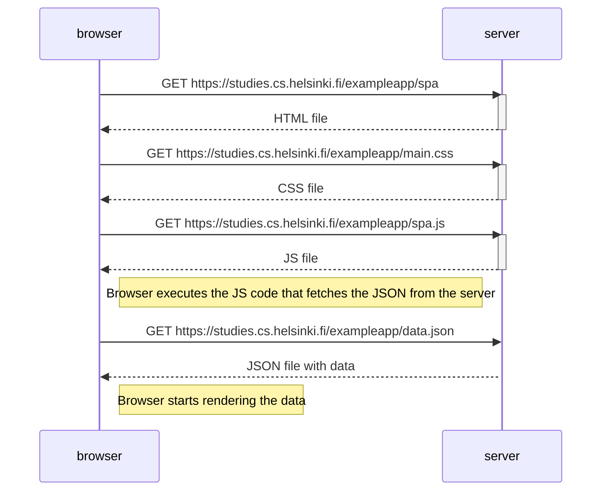

```mermaid

sequenceDiagram
    participant browser
    participant server

    browser->>server: GET https://studies.cs.helsinki.fi/exampleapp/spa
    activate server
    server-->>browser: HTML file
    deactivate server

    browser->>server: GET https://studies.cs.helsinki.fi/exampleapp/main.css
    activate server
    server-->>browser: CSS file 
    deactivate server

    browser->>server: GET https://studies.cs.helsinki.fi/exampleapp/spa.js
    activate server 
    server-->>browser: JS file 
    deactivate server

    Note right of browser: Browser executes the JS code that fetches the JSON from the server 
    browser->>server: GET https://studies.cs.helsinki.fi/exampleapp/data.json 
    activate server 
    server-->>browser: JSON file with data 
    Note right of browser: Browser starts rendering the data 
```
