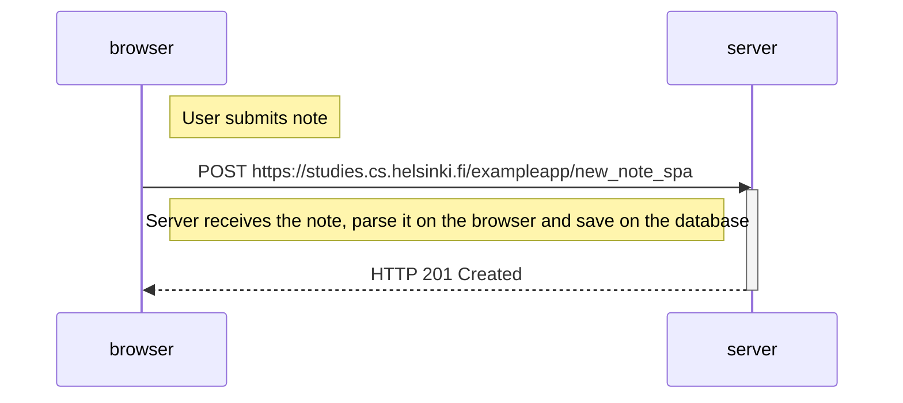

```mermaid

sequenceDiagram
    participant browser
    participant server

    Note right of browser: User submits note 
    browser->>server: POST https://studies.cs.helsinki.fi/exampleapp/new_note_spa
    activate server
    Note left of server: Server receives the note, parse it on the browser and save on the database
    server-->>browser: HTTP 201 Created
    deactivate server
```
